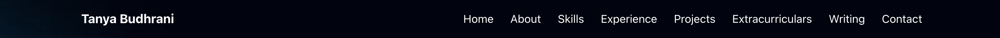
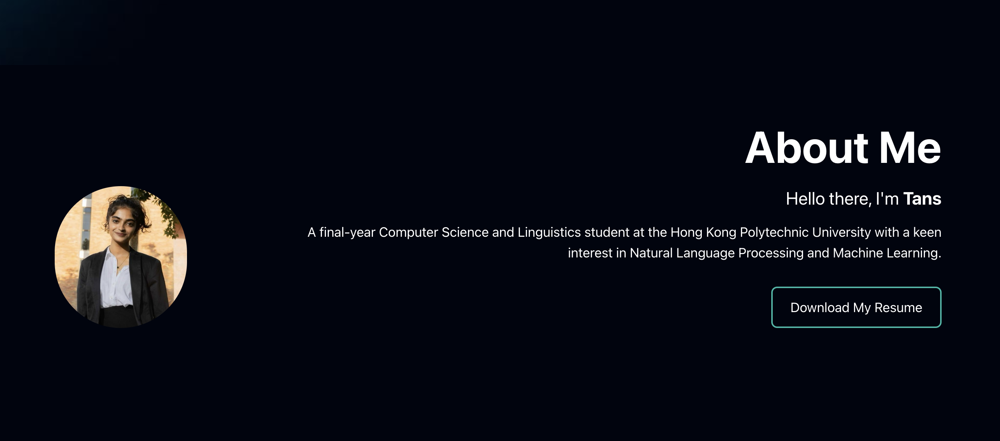
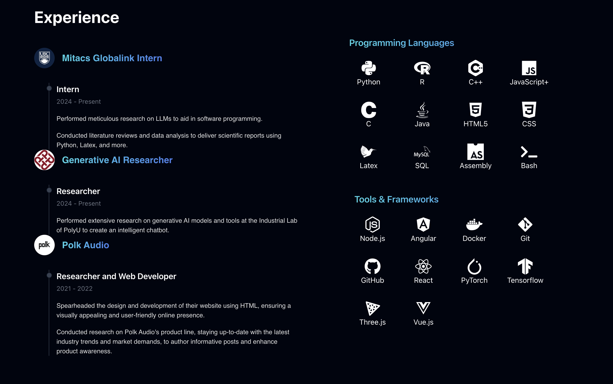
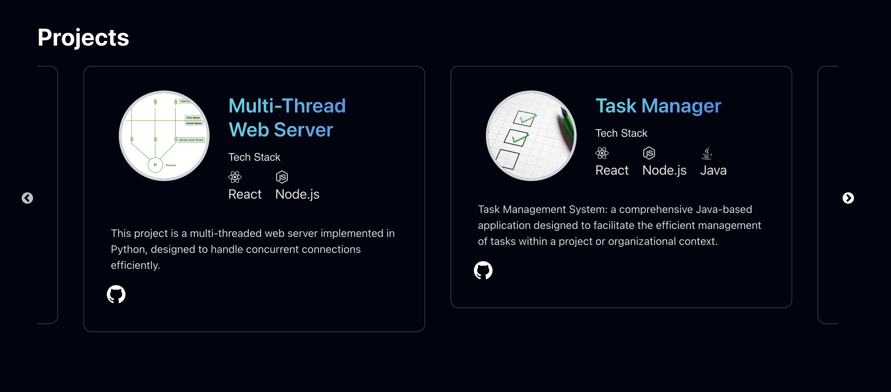
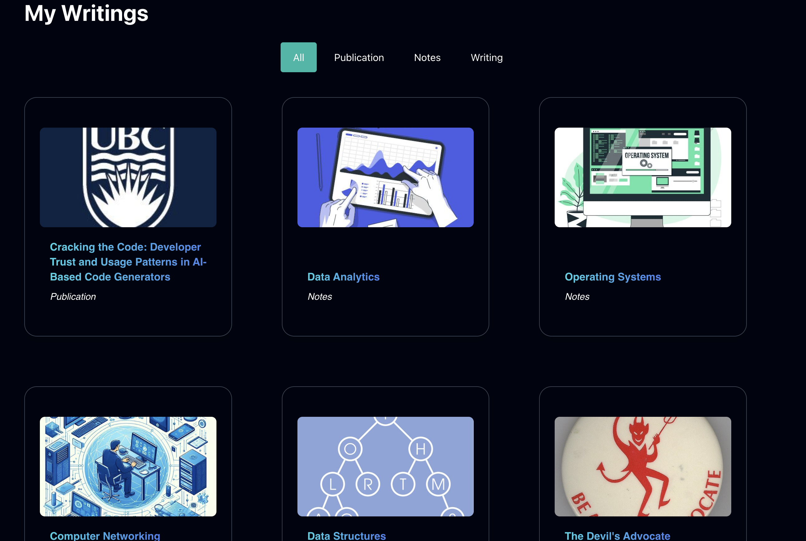
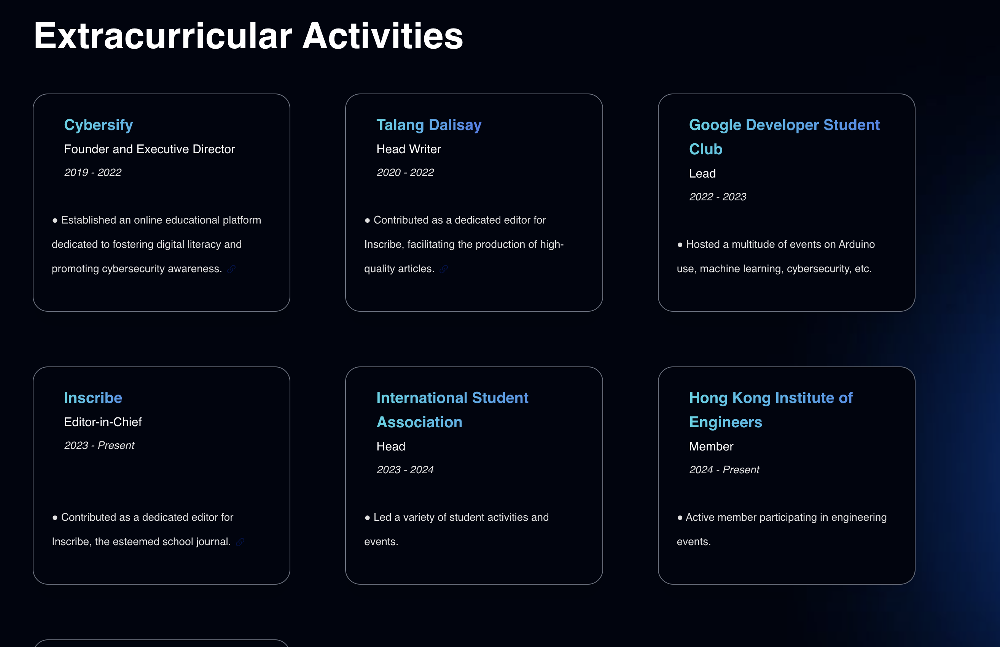

# Personal Portfolio 
Welcome to my portfolio repository! This project showcases my skills using React, Tailwind, CSS, Javascript, and Figma. It includes a brief introduction about me, my tech and research-based projects, the technologies I've worked with, and my experience. Feel free to clone this respository and tweak it to your liking.

<p align="center">
  <br>
  
  <br>
</p>

## Features

```bash
# Install dependencies
$ npm i
# run the app
$ npm run dev
```

## Files

- src: the file that implements the solutions
- assets: the images and resources used
- components: reasuable pieces of code that define the behavior and appearance of the UI
- public: oversees the entire application

## Pages

### Navbar 
The navigation bar will allow users to skip from page-to-page without having to scroll down

<p align="center">
  <br>
  
  <br>
</p>


### Hero 
This is the first thing the user sees as they enter the webpage. It contains your name and contact information. 

### About
This is where you write a short description about yourself and your interest. Feel free to include a picture of yourself.

<p align="center">
  <br>
  
  <br>
</p>

### Experience
This is where you document your experience and skills. I used the React Icons for the image sources. 

<p align="center">
  <br>
  
  <br>
</p>

### Projects
Using a carouself to sift through, you can add your projects here along with their corresponding links.

<p align="center">
  <br>
  
  <br>
</p>

### Writing 
This section is very flexible. While I did use it to showcase my research publications, you may use it in various different ways (e.g. open source projects, awards, etc)

<p align="center">
  <br>
  
  <br>
</p>

### Extracurriculars
This is where I detailed my extracurriculars, whether in University or outside. 

<p align="center">
  <br>
  
  <br>
</p>

### Contact
The bottom of the website is a contact from detailing how users can get in touch with you.

<p align="center">
  <br>
  
  <br>
</p>

## Packages

This software uses the following open source packages:
- [React](https://reactjs.org/)
- [Tailwind](https://tailwindcss.com/)
