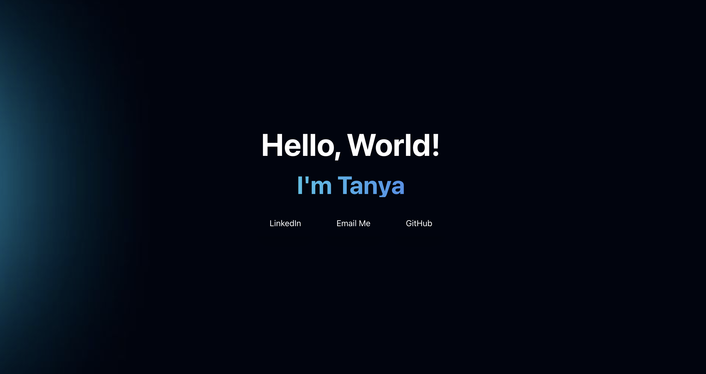

# Personal Portfolio 
Welcome to my portfolio repository! This project showcases my skills using React, Tailwind, CSS, Javascript, and Figma. It includes a brief introduction about me, my tech and research-based projects, the technologies I've worked with, and my experience. Feel free to clone this respository and tweak it to your liking.

<p align="center">
  <br>
  
  <br>
</p>

## Features

```bash
# Install dependencies
$ npm i
# run the app
$ npm run dev
```

## Files

- src: the file that implements the solutions
- assets: the images and resources used
- components: reasuable pieces of code that define the behavior and appearance of the UI
- public: oversees the entire application

## Packages

This software uses the following open source packages:
- [React](https://reactjs.org/)
- [Tailwind](https://tailwindcss.com/)
